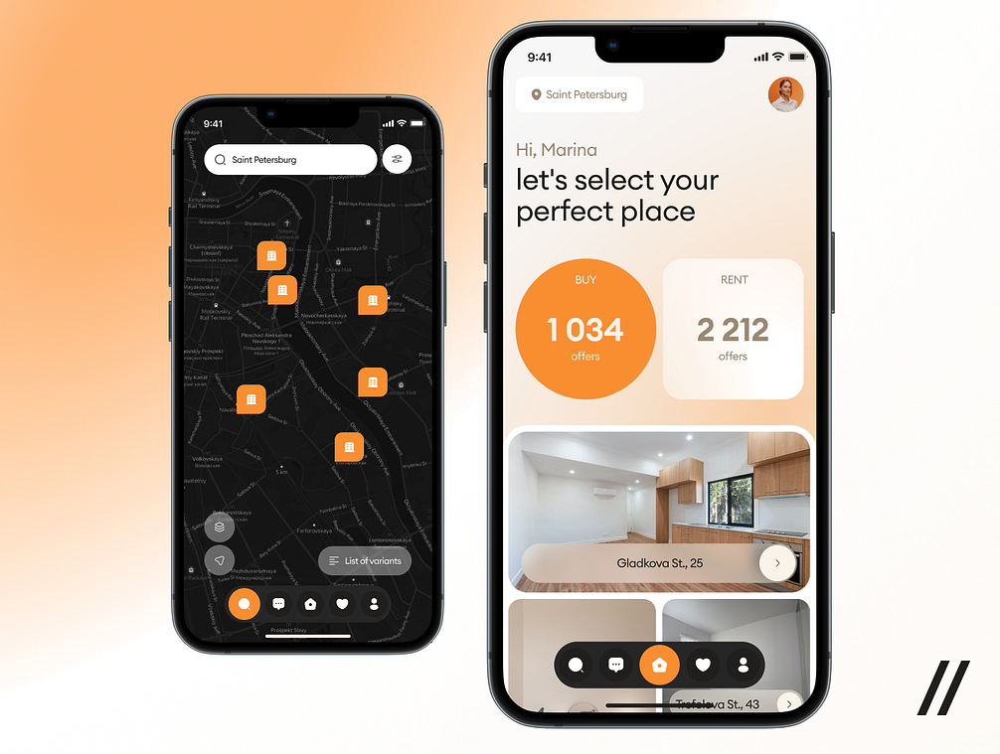

# Real Estate UI Animations

Welcome to the Real Estate UI Animations repository! This Flutter project showcases a beautifully designed and fully animated UI for a real estate app. The project demonstrates various UI components and animations tailored for real estate applications, offering a seamless and interactive user experience.

**Features**
- **Animated Property Listings**: Smooth animations for property cards.
- **Custom UI Components**: Beautifully designed custom widgets for a real estate app.
- **Implicit Animations**: Easy-to-use animations with widgets like AnimatedContainer, AnimatedOpacity, etc.
- **Explicit Animations**: Advanced control over animations using AnimationController, Tween, AnimatedBuilder, etc.

## Demo




Watch the demo video below:


# First Run

The project is configured with mock data if you run the **MOCK** flavor. See the next section for configuring run configurations.

After installing the package dependencies with

```
flutter pub get
```

run the code generation tool

```
flutter pub run build_runner build
```

